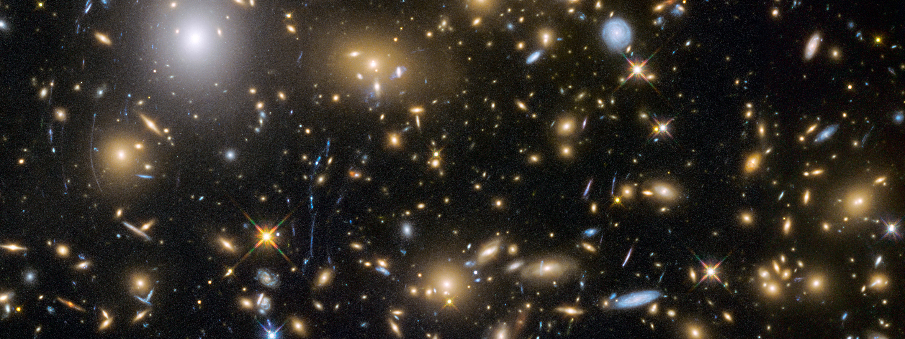
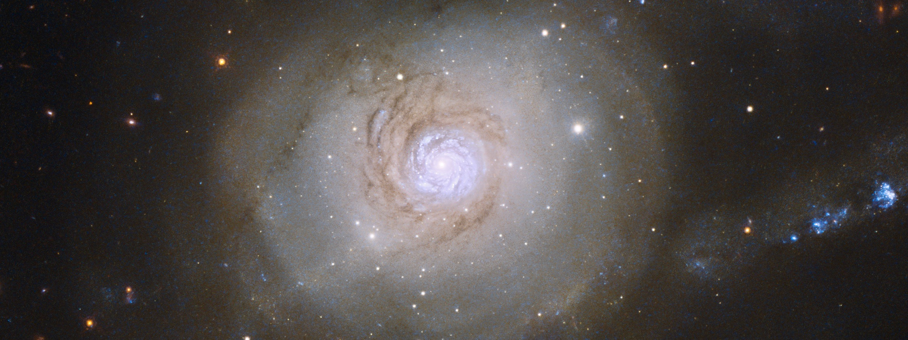

### Ionising Radiation from the First Galaxies

I have used the Hubble Space Telescope to study the UV light emitted from the first galaxies. By combining deep Hubble Space Telescope imaging with ground-based telescope data [we discovered for the first time significant leakage of Lyman Continuum photons in a large sample of early star-forming galaxies](https://doi.org/10.3847/1538-4357/ab2045). 

### The Molecular Gas Content of Local Galaxies

### Bayesian Inference of the Cosmic Abundance of Molecular Gas

